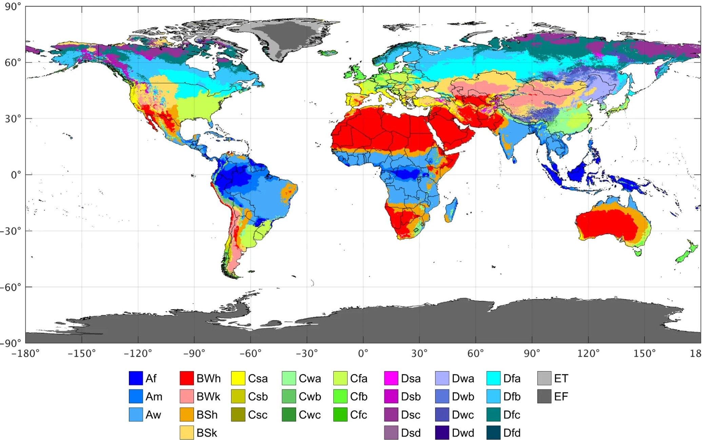

# Data

## Main data

The climate dataset to be used in this project is developed by National Oceanic and Atmospheric Administration (NOAA) and National Center for Atmospheric Research (NCAR). The product is called CNEP/NCAR Reanalysis 1 and consists of a system to perform large data assimilation from 1948 to present time. The reanalysis dataset has many products (e.g. wind fields, temperature, humidity, pressure, precipitable water) at different temporal resolutions: 4-times daily, daily, monthly values. The different meteorological indicators are available in grid format with a spatial resolution from 1.875°x1.875° to 2.5°x2.5° depending on the indicator. Data are openly available in NetCDF format in the corresponding ESRL [portal](https://www.esrl.noaa.gov/psd/data/gridded/data.ncep.reanalysis.html).

In this project, we used air temperature and precipitable water content monthly data. Temperature data was aggregated into yearly averages and monthly precipitable water was summed into yearly indicators during pre-processing in order to condense the information for the application user.

**HERE MORE INFO ABOUT THE TWO VARIABLES WE ANALYSE.**

## Auxiliary data

Countries' names and climate zones were also used (data were transformed into geojson format) in the application development to provide more information for the user about the location that he/she is consulting. Climate zones were extracted from the Köppen climate classification areas for the period 1970-2000 (data publicly available) as shown in the following figure:

Figure from: Beck, H., Zimmermann, N., McVicar, T. et al. Present and future Köppen-Geiger climate classification maps at 1-km resolution. Sci Data 5, 180214 (2018). https://doi.org/10.1038/sdata.2018.214

